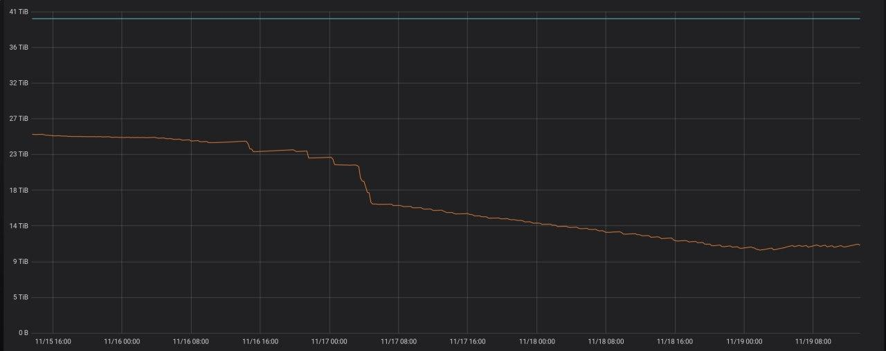

# Service to optimize stale GraphiteMergeTree tables
When you use [GraphiteMergeTree](https://clickhouse.yandex/docs/en/operations/table_engines/graphitemergetree) in ClickHouse DBMS, it applies retention policies from `system.graphite_retentions` configuration during merge processes. Unfortunately, ClickHouse doesn't launch merges for partitions a) without active inserts or b) with only one part in. It means, that it never will watch for the actual retention scheme applied to partitions.  
This software looking for tables with GraphiteMergeTree engine and evaluate if some of partitions should be optimized. It could work both as one-shot script and background daemon.

## Build
To build a binary just run `make`.

You should have make, golang and [fpm](https://github.com/jordansissel/fpm) installed to build packages. To build packages run one of the following:

```
make packages
make deb
make rpm
```

### Publish new version

After checks are green for the latest commit in master, create a tag with format `v1.2.3` with 1 as major, 2 as minor and 3 as patch version.  
The workflow will build packages and upload them as release's assets.

In the same time, the Docker Hub will build the images for the latest and `1.2.3` tags.

## Docker

To build docker image locally run:  
`make docker`

To launch the container run the following command on the host with a running ClickHouse server:  
`docker run --net=host --rm innogames/graphite-ch-optimizer:latest`

## FAQ
* The `go` version 1.13 or newer is required
* Daemon mode is preferable over one-shot script for the normal work
* It's safe to run it on the cluster hosts
* You could either run it on the one of replicated host or just over the all hosts
* There are two different parameters in DSN, that should be adjusted together to fix timeouts for big partitions (month or something like this) optimizing:
  * `read_timeout` - `clickhouse-go` parameter. Controls the timeout between the `graphite-ch-optimizer` and ClickHouse server.
  * `receive_timeout` - ClickHouse parameter, used when the OPTIMIZE query is applied in the cluster. See [comment](https://github.com/ClickHouse/ClickHouse/issues/4831#issuecomment-708721042) in the issue.
* `optimize_throw_if_noop=1` is not mandatory, but good to have.
* The next picture demonstrates the result of running the daemon for the first time on ~3 years old GraphiteMergeTree table:  


### Details
The next query is executed with some additional conditions as search for the partitions to optimize:

```sql
SELECT
    concat(p.database, '.', p.table) AS table,
    p.partition_id AS partition_id,
    p.partition AS partition,
    max(g.age) AS age,
    countDistinct(p.name) AS parts,
    toDateTime(max(p.max_date + 1)) AS max_time,
    max_time + age AS rollup_time,
    min(p.modification_time) AS modified_at
FROM system.parts AS p
INNER JOIN
(
    SELECT
        Tables.database AS database,
        Tables.table AS table,
        age
    FROM system.graphite_retentions
    ARRAY JOIN Tables
    GROUP BY
        database,
        table,
        age
) AS g ON (p.table = g.table) AND (p.database = g.database)
WHERE p.active AND ((toDateTime(p.max_date + 1) + g.age) < now())
GROUP BY
    table,
    partition,
    partition_id
HAVING (modified_at < rollup_time) OR (parts > 1)
ORDER BY
    table ASC,
    partition ASC,
    age ASC
```

#### The next queries could be executed before and after the daemon running

* Detailed info about each partition of GraphiteMergeTree tables:

```sql
SELECT
    database,
    table,
    count() AS parts,
    active,
    partition,
    min(min_date) AS min_date,
    max(max_date) AS max_date,
    formatReadableSize(sum(bytes_on_disk)) AS size,
    sum(rows) AS rows
FROM system.parts AS p
INNER JOIN
(
    SELECT
        Tables.database AS database,
        Tables.table AS table
    FROM system.graphite_retentions
    ARRAY JOIN Tables
    GROUP BY
        database,
        table
) AS g USING (database, table)
GROUP BY
    database,
    table,
    partition,
    active
ORDER BY
    database,
    table,
    partition,
    active ASC
```

* Summary about each GraphiteMergeTree table:

```sql
SELECT
    database,
    table,
    count() AS parts,
    active,
    min(min_date) AS min_date,
    max(max_date) AS max_date,
    formatReadableSize(sum(bytes_on_disk)) AS size,
    sum(rows) AS rows
FROM system.parts AS p
INNER JOIN
(
    SELECT
        Tables.database AS database,
        Tables.table AS table
    FROM system.graphite_retentions
    ARRAY JOIN Tables
    GROUP BY
        database,
        table
) AS g USING (database, table)
GROUP BY
    database,
    table,
    active
ORDER BY
    database ASC,
    table ASC,
    active ASC
```

They will show general info about every GraphiteMergeTree table on the server.

## Run the graphite-ch-optimizer
If you run the ClickHouse locally, you could just run `graphite-ch-optimizer -n --log-level debug` and see how many partitions on the instance are able to be merged automatically.

Default config:

```toml
[clickhouse]
  optimize-interval = "72h0m0s"
  server-dsn = "tcp://localhost:9000?&optimize_throw_if_noop=1&receive_timeout=3600&debug=true&read_timeout=3600"

[daemon]
  dry-run = false
  loop-interval = "1h0m0s"
  one-shot = false

[logging]
  log-level = "info"
  output = "-"
```

Possible command line arguments:

```
Usage of graphite-ch-optimizer:
  -c, --config string                Filename of the custom config. CLI arguments override it (default "/etc/graphite-ch-optimizer/config.toml")
      --print-defaults               Print default config values and exit
  -v, --version                      Print version and exit
      --optimize-interval duration   The partition will be merged after having no writes for more than the given duration (default 72h0m0s)
  -s, --server-dsn string            DSN to connect to ClickHouse server (default "tcp://localhost:9000?&optimize_throw_if_noop=1&receive_timeout=3600&debug=true&read_timeout=3600")
  -n, --dry-run                      Will print how many partitions would be merged without actions
      --loop-interval duration       Daemon will check if there partitions to merge once per this interval (default 1h0m0s)
      --one-shot                     Program will make only one optimization instead of working in the loop (true if dry-run)
      --log-level string             Valid options are: panic, fatal, error, warn, warning, info, debug, trace
      --output string                The logs file. '-' is accepted as STDOUT (default "-")

Version: version-string
```
